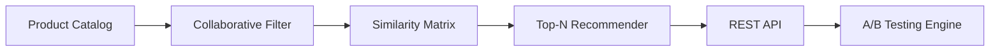
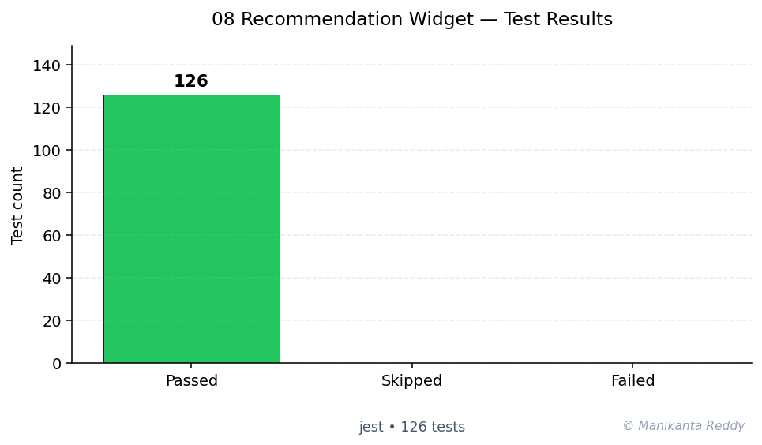

# E-Commerce Product Recommendation Widget

[](https://nodejs.org/)
[](https://expressjs.com/)
[](https://jestjs.io/)
[](LICENSE)

A complete, production-grade e-commerce product recommendation system built from scratch with Node.js and Express. Features collaborative filtering, content-based filtering, hybrid recommendation strategies, user behavior tracking, and an A/B testing framework - all implemented without external ML libraries.

## Features

- **Multiple Recommendation Algorithms**
  - Collaborative Filtering (user-user similarity with cosine similarity)
  - Content-Based Filtering (category/tag matching with price awareness)
  - Hybrid Strategy (weighted combination with diversification)
  - Popularity-Based Fallback for cold-start users

- **User Behavior Tracking**
  - Product views, purchases, ratings, and cart additions
  - User affinity profiles with time-decay weighting
  - Co-purchase pattern mining for "Customers also bought"
  - Trending product detection

- **A/B Testing Framework**
  - Create and manage experiments with multiple variants
  - Deterministic user assignment using consistent hashing
  - Event recording and statistical significance calculation
  - Built-in preset experiments for strategy comparison

- **Interactive Widget**
  - Beautiful responsive UI with grid and carousel layouts
  - Real-time recommendation switching
  - A/B test variant visualization
  - Event simulation and monitoring

- **RESTful API**
  - Full CRUD for products and experiments
  - Multiple recommendation endpoints
  - Health check and dashboard endpoints
  - Comprehensive error handling

## Tech Stack

| Component | Technology |
|-----------|-----------|
| Runtime | Node.js 18+ |
| Framework | Express 4.18 |
| Testing | Jest 29 |
| Frontend | Vanilla JavaScript, CSS3 |
| Data | JSON (in-memory, extensible to Redis/DB) |

## Quick Start

### Prerequisites

- [Node.js](https://nodejs.org/) 16 or higher
- npm (comes with Node.js)

### Installation

```bash
# Clone the repository
git clone <repository-url>
cd project_08_recommendation_widget

# Install dependencies
npm install

# Run tests
npm test

# Start the server
npm start
```

The server will start on `http://localhost:3000` with a pre-loaded catalog of 20 products and simulated user behavior data.

### View the Widget

Open your browser and navigate to `http://localhost:3000/widget` to see the interactive recommendation widget.

## API Usage Examples

### Get Personalized Recommendations

```bash
# Default hybrid strategy
curl "http://localhost:3000/api/recommendations/personalized?userId=user_1&limit=6"

# With A/B test experiment
curl "http://localhost:3000/api/recommendations/personalized?userId=user_1&experimentId=YOUR_EXP_ID"

# Specific strategy
curl "http://localhost:3000/api/recommendations/personalized?userId=user_1&strategy=collaborative"
```

### Track User Behavior

```bash
# Track a product view
curl -X POST "http://localhost:3000/api/tracking/view" \
  -H "Content-Type: application/json" \
  -d '{"userId": "user_1", "productId": "p001", "category": "electronics", "tags": ["bluetooth"], "price": 79.99}'

# Track a purchase
curl -X POST "http://localhost:3000/api/tracking/purchase" \
  -H "Content-Type: application/json" \
  -d '{"userId": "user_1", "productId": "p001", "price": 79.99}'

# Track a rating
curl -X POST "http://localhost:3000/api/tracking/rating" \
  -H "Content-Type: application/json" \
  -d '{"userId": "user_1", "productId": "p001", "rating": 5}'
```

### Product Catalog

```bash
# List products with pagination
curl "http://localhost:3000/api/products?page=1&limit=10&sortBy=price&order=asc"

# Filter by category
curl "http://localhost:3000/api/products?category=electronics&minRating=4.0"

# Search
curl "http://localhost:3000/api/products/search?q=headphones"

# Get similar products
curl "http://localhost:3000/api/products/p001/similar?limit=5"
```

### A/B Testing

```bash
# List experiments
curl "http://localhost:3000/api/experiments"

# Create experiment
curl -X POST "http://localhost:3000/api/experiments" \
  -H "Content-Type: application/json" \
  -d '{
    "name": "My Experiment",
    "description": "Testing strategies",
    "variants": [
      {"id": "control", "name": "Control", "trafficAllocation": 0.5},
      {"id": "variant_a", "name": "Variant A", "trafficAllocation": 0.5}
    ]
  }'

# Start experiment
curl -X POST "http://localhost:3000/api/experiments/EXP_ID/start"

# Get results
curl "http://localhost:3000/api/experiments/EXP_ID/results"

# View dashboard
curl "http://localhost:3000/api/dashboard"
```

### Simulate Data

```bash
# Generate 50 simulated user events
curl -X POST "http://localhost:3000/api/simulate" \
  -H "Content-Type: application/json" \
  -d '{"count": 50}'
```

## Widget Screenshots

### Personalized Recommendations

*The "Recommended For You" section powered by hybrid collaborative + content-based filtering*

### Customers Also Bought

*"Customers Also Bought" based on co-purchase pattern mining*

### A/B Test Dashboard

*Built-in A/B testing dashboard with variant performance metrics*

## Project Structure

```
project_08_recommendation_widget/
├── src/
│   ├── server.js              # Express server and middleware
│   ├── catalog.js             # Product catalog management
│   ├── behavior_tracker.js    # User behavior tracking
│   ├── recommender.js         # Recommendation algorithms
│   ├── ab_testing.js          # A/B testing framework
│   └── routes/
│       ├── products.js        # Product API routes
│       ├── recommendations.js # Recommendation API routes
│       └── tracking.js        # Tracking API routes
├── public/
│   ├── widget.html            # Interactive widget demo
│   ├── css/
│   │   └── widget.css         # Widget styles
│   └── js/
│       └── widget.js          # Widget frontend logic
├── tests/
│   ├── test_recommender.js    # Recommendation engine tests
│   ├── test_catalog.js        # Catalog tests
│   └── test_ab_testing.js     # A/B testing tests
├── data/
│   └── products.json          # Sample product catalog (20 items)
├── docs/
│   └── architecture.md        # Architecture documentation
├── package.json
├── README.md
├── LICENSE
├── .gitignore
```

## Architecture

The system uses a modular service-oriented architecture:

### Services

| Service | Description | Key Methods |
|---------|-------------|-------------|
| **ProductCatalog** | Product data management | `getProduct()`, `search()`, `getSimilar()`, `getPaginated()` |
| **BehaviorTracker** | User behavior recording | `trackView()`, `trackPurchase()`, `trackRating()`, `getUserAffinities()` |
| **RecommendationEngine** | ML algorithms | `getRecommendations()`, `collaborativeFiltering()`, `contentBasedFiltering()` |
| **ABTestingFramework** | Experiment management | `createExperiment()`, `assignUser()`, `recordEvent()`, `getResults()` |

### Recommendation Algorithm

```
User Request
  |
  v
Strategy Selection (A/B test or default)
  |
  +-- Collaborative Filtering --+-- User affinity vectors
  |                              +-- Cosine similarity
  |                              +-- Top-K similar users
  +-- Content-Based Filtering --+-- Category/tag matching
  |                              +-- Price range scoring
  |                              +-- Rating & popularity boost
  +-- Popularity Fallback ------+
  |
  v
Score Normalization & Weighted Combination
  |
  v
Diversification (category balance)
  |
  v
Exclude purchased items
  |
  v
Enrich with product data & return
```

See [docs/architecture.md](docs/architecture.md) for detailed documentation.

## Testing

```bash
# Run all tests
npm test

# Run tests in watch mode
npm run test:watch

# Run with coverage
npm test -- --coverage
```

### Test Coverage

- **Recommendation Engine**: Collaborative filtering, content-based, hybrid strategies, cosine similarity, diversification
- **Product Catalog**: Loading, search, pagination, similarity, validation
- **A/B Testing Framework**: Experiment lifecycle, user assignment, event recording, results

## Future Improvements

- **Real-time Updates**: WebSocket integration for live recommendation updates
- **Persistent Storage**: Redis/MongoDB backend for production scale
- **Matrix Factorization**: Implement SVD for latent factor collaborative filtering
- **Deep Learning**: Neural collaborative filtering with embeddings
- **Multi-armed Bandits**: Thompson sampling for dynamic A/B testing
- **Caching Layer**: Redis-based recommendation caching with invalidation
- **Monitoring**: Prometheus metrics and Grafana dashboards
- **Authentication**: JWT-based user authentication
- **Admin Dashboard**: React-based management UI for experiments and catalog
- **Batch Processing**: Nightly recommendation pre-computation jobs

## License

This project is licensed under the MIT License - see the [LICENSE](LICENSE) file for details.

## Contributing

Contributions are welcome! Please feel free to submit a Pull Request.

---

<!-- showcase:start -->

## Architecture



## Test Results



**126 passing**, **0 failing**, **0 skipped** (total 126, framework: Jest)

## References & Further Reading

- Sarwar, B. et al. (2001). *Item-based collaborative filtering recommendation algorithms.* WWW '01. [↗](https://dl.acm.org/doi/10.1145/371920.372071)
- Koren, Y., Bell, R., & Volinsky, C. (2009). *Matrix Factorization Techniques for Recommender Systems.* IEEE Computer 42(8). [↗](https://ieeexplore.ieee.org/document/5197422)

## Author

**Manikanta Reddy Mandadhi** — Senior Data Scientist (RAG / Agentic AI)

GitHub: [@Mani9006](https://github.com/Mani9006/ecommerce-recommendation) · LinkedIn: [reddy1999](https://www.linkedin.com/in/reddy1999) · Portfolio: [manikantabio.com](https://www.manikantabio.com)

<!-- showcase:end -->
